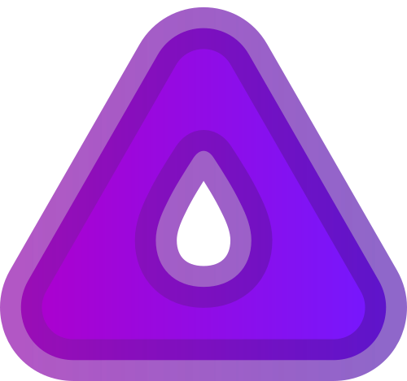

<div align="center">
  
  <h1>mın̶ı AN̶S̶I</h1>
  <h4>minimal ansi escape colors</h4>
  <h5>zero dependencies</h5>
</div>


---

## DESCRIPTION

Minimal ANSI color escape utility in [under 10 lines](src/index.js)!


<div align="center">
  
  <p><a href="https://github.com/metaory/mini-ansi/blob/master/src/index.js">src/index.js</a></p>
</div>

---

Usage
-----

```sh
# install
npm install mini-ansi
```

```js
// const ansi = require('mini-ansi') // CJS
import C from 'mini-ansi' // ESM
const { log } = console

log(C.f2('green fg'), 'normal text', C.b4(' red bg '))
log('norm', C.f1b3('red fg and yellow bg'), 'orrr', C.b2f6('cyan fg ongreen bg'))
```


> [!Caution]
> ONLY SUPPORT base16
>
> - `f` or `b` can come in any order


> [!Important]
> NOT_IMPLEMENTED
>
> - color names
> - modifiers
> - background color
> - tag function for template literals
> - chained calls

## Why not ...

- [ ] TODO: WRITE REASONS!


---

## License

[MIT](LICENSE)
